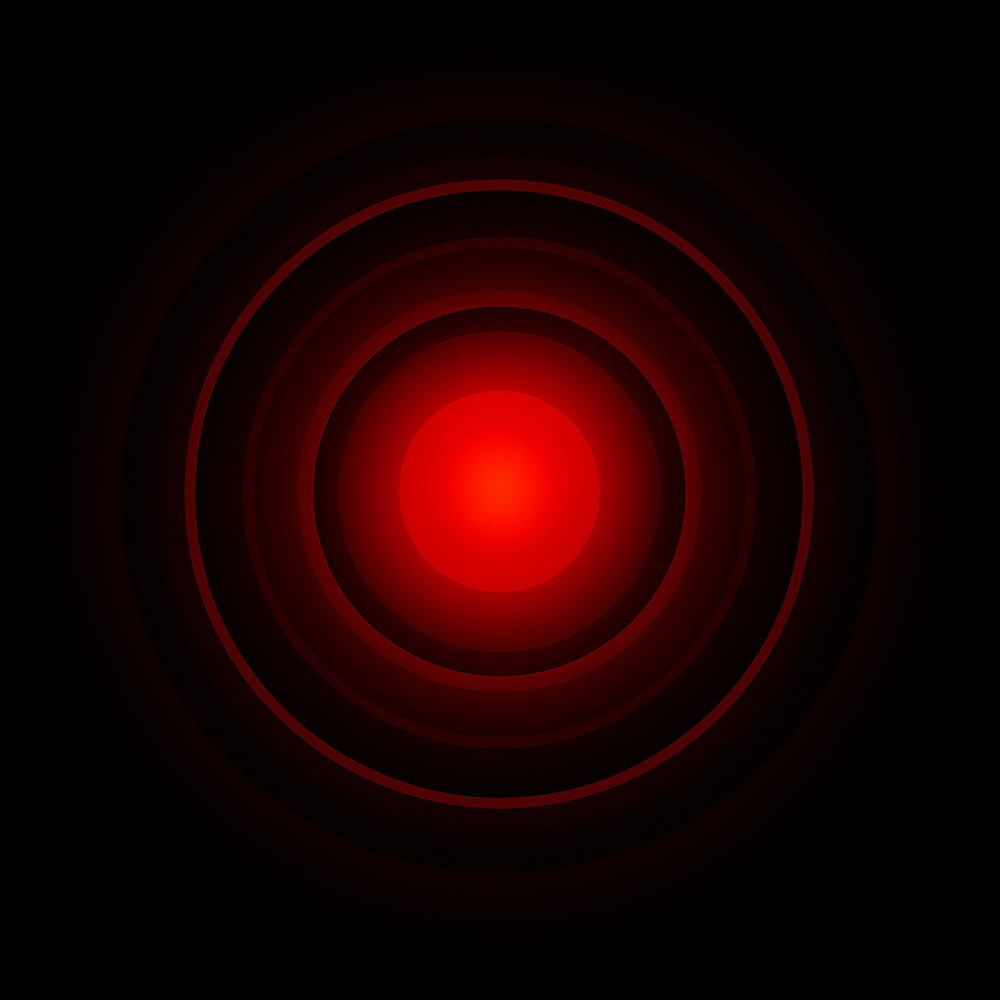

# 🔥 Skynet Shredder

**Secure GUI tool to permanently delete files and folders – HDD & SSD aware, recursive, and themed after the legendary Skynet AI.**



---

[](https://www.python.org/)
[](LICENSE)
[](#)

---

## 🚀 Features

- **Drag & Drop**: Add files and folders easily  
- **Recursive delete**: Wipe entire directories securely  
- **HDD mode**: Multi-pass overwrite using `shred` (1–35 passes or Gutmann method)  
- **SSD mode**: Smart delete + `fstrim` (TRIM) for block-level wipe  
- **Progress display**: Live logging and progress bar UI  
- **Dark futuristic theme**: Inspired by the Skynet AI  
- **Works right away** on Debian/Ubuntu-based Linux distros  
- No external database, internet or telemetry needed

---

## 📦 Installation

### 🔧 Requirements (Debian 13 / Ubuntu)

```bash
sudo apt update
sudo apt install -y python3 python3-pyqt5 coreutils util-linux
